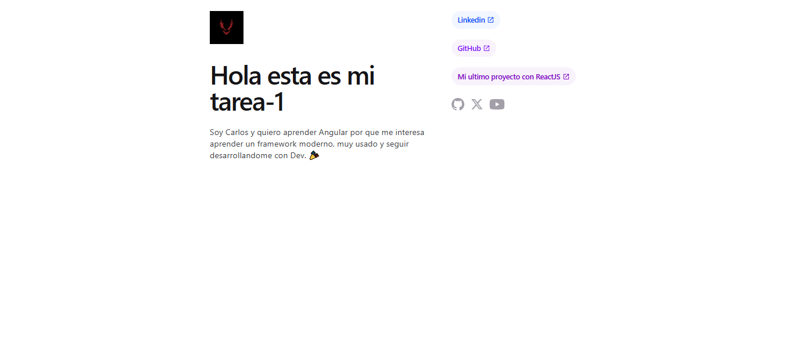

## TAREA N°1

## DECRIPCION

Aplicación web básica desarrollada con Angular, donde se implementa interpolación de variables dinámicas desde el componente principal hacia la plantilla,. 

## Lenguajes utilizados

- Angular 17
- TypeScript
- HTML
- CSS

## Clonar el repositorio
## 1. Clonar el repositorio

bash
git clone https://github.com/Carlosss8/Tareas-Angular-UTN.BA

## 2. Ingresar a la carpeta del proyecto

cd Tareas-Angular-UTN.BA

## 3. Instalar dependencias

npm install

## 4. Ejecutar la aplicación
ng serve

## AUTOR
NOMBRE: Carlos Rodriguez UNIDAD: Modulo 1 - Unidad 1

## Fuentes

## Ejercicios y PostData

